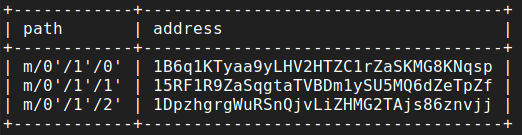
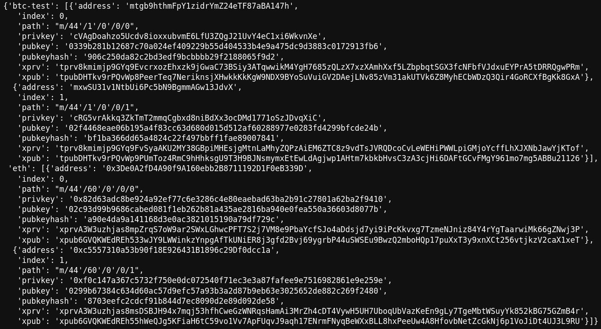
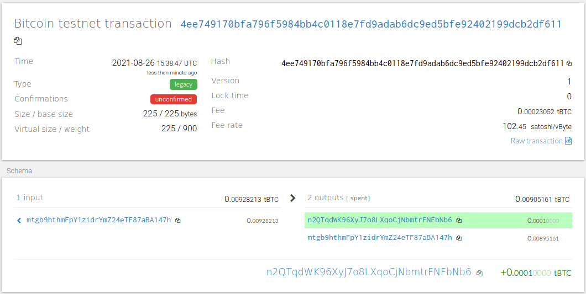
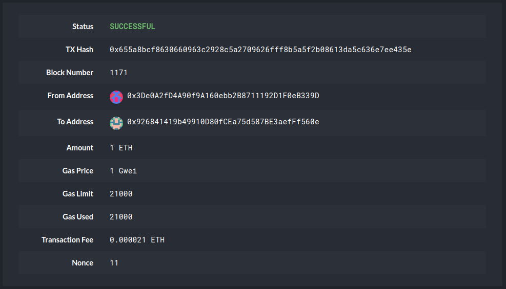

# 🐍🪙 Multi-Blockchain Wallet in Python ₿🐍


## Create a wallet for most popular crypto-currencies with only one mnemonic using [hd-derive-wallet](https://github.com/dan-da/hd-wallet-derive).  

### To install hd-wallet-derive open a terminal and enter the following:
```
  git clone https://github.com/dan-da/hd-wallet-derive
  cd hd-wallet-derive
  curl https://getcomposer.org/installer -o installer.php
  php installer.php
  php composer.phar install
```
### While in the application's directory execute the following command to verifiy the installation:
```
./hd-wallet-derive.php -g --key=xprv9tyUQV64JT5qs3RSTJkXCWKMyUgoQp7F3hA1xzG6ZGu6u6Q9VMNjGr67Lctvy5P8oyaYAL9CAWrUE9i6GoNMKUga5biW6Hx4tws2six3b9c --numderive=3 --preset=bitcoincore --cols=path,address --path-change
```
That will result in output like this:



### Use the following website to generate a BIP39 mnemonic for your new wallet:
[Mnemonic Code Converter](https://bip39converttool.io/)
Save the mnemonic in a safe place.


### Next, download the `wallet.py` script in this project:
```
git clone git@github.com:jdfwsp/multi_chain_wallet.git
cd multi_chain_wallet
```
### Now you need to create a .env file that will hold your mnemonic:
```
touch .env
cat > .env
mnemonic = 'insert your 12 word mnemonic here'
```
Press Ctrl+d to close the `cat` application

### Change into `Code` directory, launch `python` shell and import `wallet` to use the functions interactively:
```
cd Code
python3
Python 3.9.5 
[GCC 10.3.0] on linux
Type "help", "copyright", "credits" or "license" for more information.
>>> import wallet
>>> 
```
### Next you need to import some more dependencies and load your environment variable to access your mnemonic:
```
>>> import bit
>>> from bit.network import NetworkAPI
>>> import lit
>>> from web3 import Web3
>>> from web3.middleware import geth_poa_middleware
>>> from eth_account import Account
>>> import subprocess
>>> import json
>>> import os
>>> from dotenv import load_dotenv
>>> from constants import *
>>> load_dotenv()
True
>>>
```
Create ETH connection object:
```
>>> w3 = Web3(Web3.HTTPProvider('{Use network address for ETH blockchain}'))
>>> w3.isConnected()
True
>>> w3.middleware_onion.inject(geth_poa_middleware, layer=0)
```
Next run the `derive_wallets` function to generate a wallet object for BTC and ETH:
```
>>> coins = {BTCTEST: derive_wallets(BTCTEST), ETH: derive_wallets(ETH)}
>>> coins
```
This will create a wallet object for you similar to this:


## Now you have a multichain wallet capable and can send and receive transactions in the `python` shell!
(see test notebook for examples)

